# Information Visualization Final Project - Forest type mapping Data Set

## Data description

Forest type mapping Dataset is from the UCI Machine Learning Repository(https://archive.ics.uci.edu/ml/datasets/Forest+type+mapping ). The source of this dataset was collected in a forested area in Ibaraki Prefecture(36◦ 57′ N, 140◦ 38′ E), Japan, where contains mainly Cryptomeria japonica (Sugi, or Japanese Cedar) planted forest, Chamaecyparis obtusa (Hinoki, or Japanese Cypress) planted forest and mixed deciduous broadleaf natural forest. The total area where the data was collected is approximately 13 km × 12 km. Data was collected by 15 m spatial resolution multispectral Advanced Spaceborne Thermal Emission and Reflection Radiometer(ASTER) and removed the effects of image perspective(tilt) and relief (terrain) effects by Orthorectification. Only the information in three bands of the images was remained in the dataset: green (0.52–0.60 μm), red (0.63–0.69 μm) and near-infrared (NIR) (0.76–0.86 μm).    `(Johnson, Tateishi, & Xie, 2012)`

This data set contains two parts: training and testing. the trainning set has 199 instances, testing data has 325 instances. Each dataset has 27 attributes. Since this is a dataset used to solve classification problems, the first column is the class of each instance: 's', 'h', 'd' and 'o', represent 'Sugi forest', 'Hinoki forest', 'Mixed deciduous' forest' and 'Other non-forest land respectively. From the second column to the tenth column(b1 to b9 ) are the ASTER image of three bands(green, red, and near infrared wavelengths) for three dates (Sept. 26, 2010; March 19, 2011; May 08, 2011).  In order to minimize classification errors, the image data was predicted by using inverse distance weighting (IDW) interpolation method. The idea of this method is that the geographic data sets has spatial autocorrelation `(O’Sullivan and Unwin 2003)`, which means that two areas that located close to each other share the similar natrure characteristics. In the dataset, column 11 to column 28 are the information created by this idea. Column 11 to 19(pred_minus_obs_S_b1 - pred_minus_obs_S_b9) are the predicted value minus actual spectral values for the 's' class(b1 -b9); column 20 to 28(pred_minus_obs_S_b1 - pred_minus_obs_S_b9) are the predicted value minus actual spectral values for the 's' class(b1 -b9); 

- List of columns:

`class`, `b1`, `b2`, `b3`, `b4`, `b5`, `b6`, `b7`, `b8`, `b9`, `pred_minus_obs_H_b1`, `pred_minus_obs_H_b2`, `pred_minus_obs_H_b3`, `pred_minus_obs_H_b4`, `pred_minus_obs_H_b5`, `pred_minus_obs_H_b6`, `pred_minus_obs_H_b7`, `pred_minus_obs_H_b8`, `pred_minus_obs_H_b9`, `pred_minus_obs_S_b1`, `pred_minus_obs_S_b2`, `pred_minus_obs_S_b3`, `pred_minus_obs_S_b4`, `pred_minus_obs_S_b5`, `pred_minus_obs_S_b6`, `pred_minus_obs_S_b7`, `pred_minus_obs_S_b8`, `pred_minus_obs_S_b9`


## Visualizations


- Distribution of classes

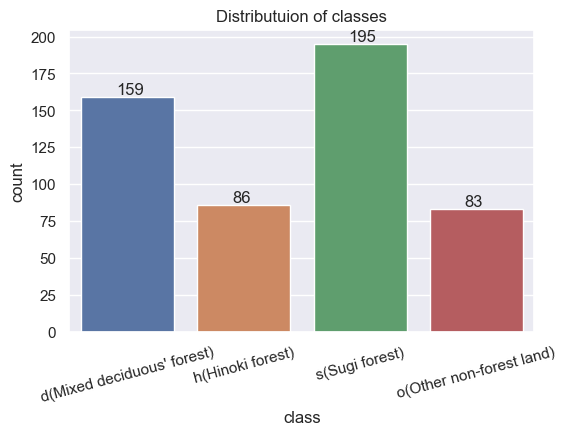

Figure X shows the distributuion of for forest types of the dataset. The X axis is four forest types, Y axis is the occurrence of each type. 

- Band values

  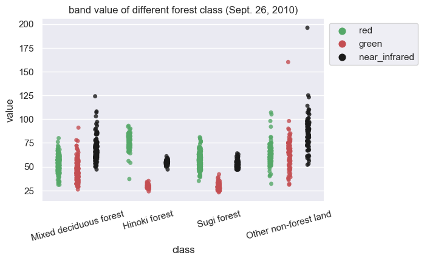

  

  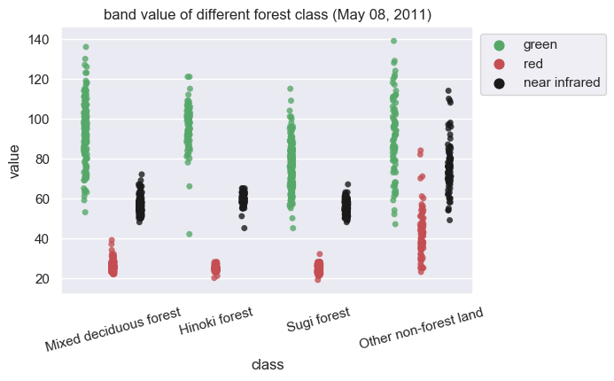

Figure 003 to 005 show the image information in each bands of four different forest types. X axis lables are the forest types, Y axis is the image information. For each types of forest, the image was seprated in three bands: green, red and near infrared, ploted in greed, red and black respectively.

- 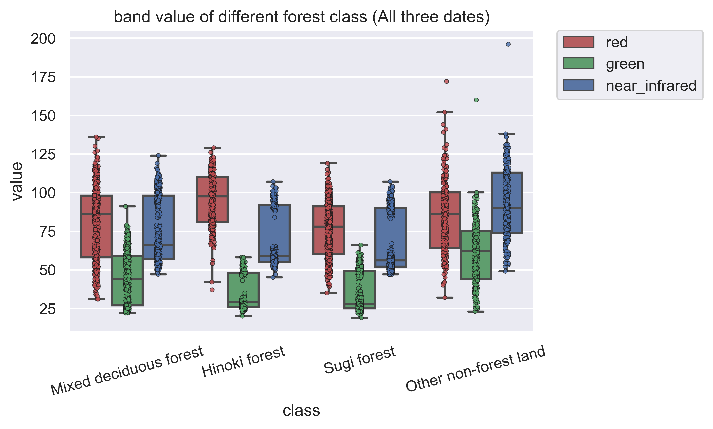

Figure 006 is the scatter plot and botplot of each type of forest. The X asix is for types of forest, the y axis is the value of image bands. For each type of forest, the three bands of image ploted sepretely, red band plot in red, green band plot in green and near infrared ploted in blue in order to see the line in the boxplot clearly. This figure mainly shows the relationship of image infortion bewteen each bands within the same type of forest. The higher value in red band indicateds that the color of this forest may closer to red, so does the green band.

- 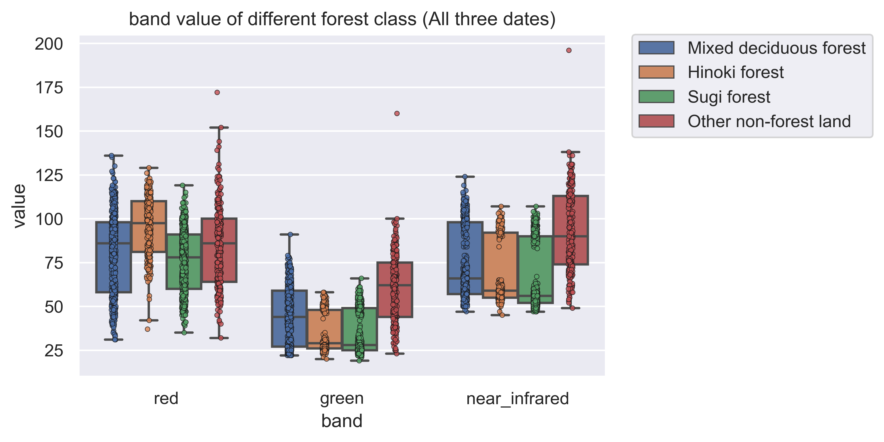

  Figure 007 is the scatter plot and botplot of each band of image. The X axis is the three sepreated bands of image, Y axis is the value of image bands. In each band, four different types of forest were plotted in four different colors: blue for Mixed diciduous forest, Yellow for Hinoki forest, green for Sugi forest, and red for other non-forest land. This figure shows how different type of forest differ in different image bands. Take red bans as an example, the Hinoki forest has the highest mean value, and sugi forest has the lowest mean value.

- 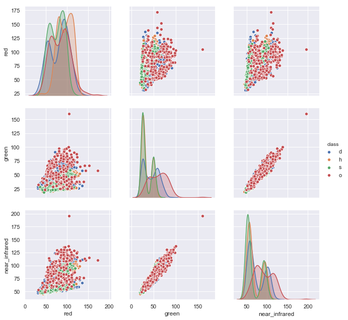

  Figure 008 is the pair plot of each type of forest. It shows the relationship between each image bands and forest class.

- 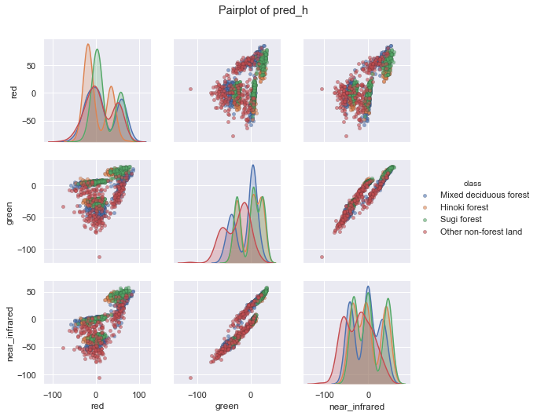

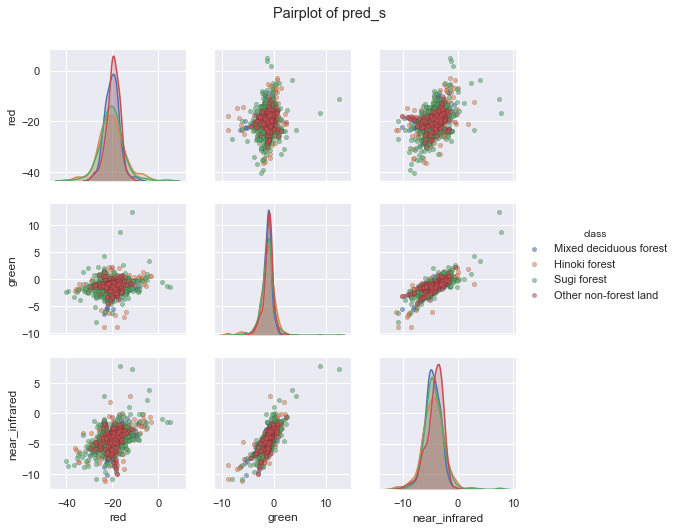

Figure 009 and 010 are the pair plot of pred_h and pred_s, which are the predicted value by IDW interpolation method minus the original band value. The X axis and Y axis is three image bands. These two figure may show the relationship between each image bands and forest class.

## Observations

This dataset is mainly for the problem of forest type classification, but the figures shown in the Visualization part did not ideally show the pattern of four different types. 

Thus I used PCA to do the dimentionality reduction in order to find the relationship:


Figure 011 shows the persentage of information can be interpreted by principal components. As shown in the figure, the first 15 principal components could explain almost all the information.

By using PCA, we can plot the data into a 2D figure:

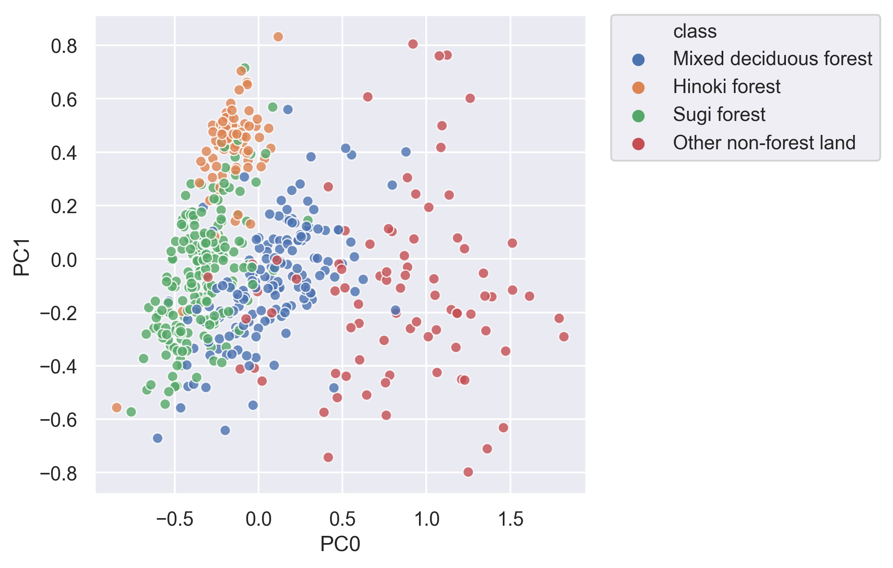

Figure 012 is the scatter plot of first two pricipal component. Four different types of forest are plotted in differnet color. X axis is PC0, Y axis is PC1. From this figure, the pattern is much more clear than the scatter plot in previous part. We can see that most of the red points are in the right of the figure, yellow points, green points and blue points have reletively clear cluster in this figure.

In order to see this pattern more clearly, I use kdeplot to plot the first principle componinets:

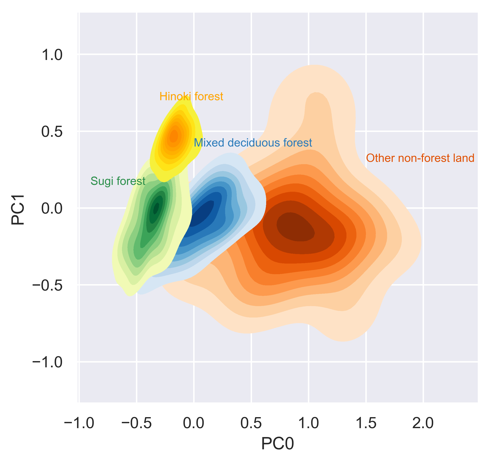

Similar as the scatter plot, the Figure 013 also use PC0 and PC1 as two axis. It plot the kernel density estimation of each type of forest, which shown a much clear cluster pattern than scatter plot.

Then I used several machine learning algothrim to seperate different classes:

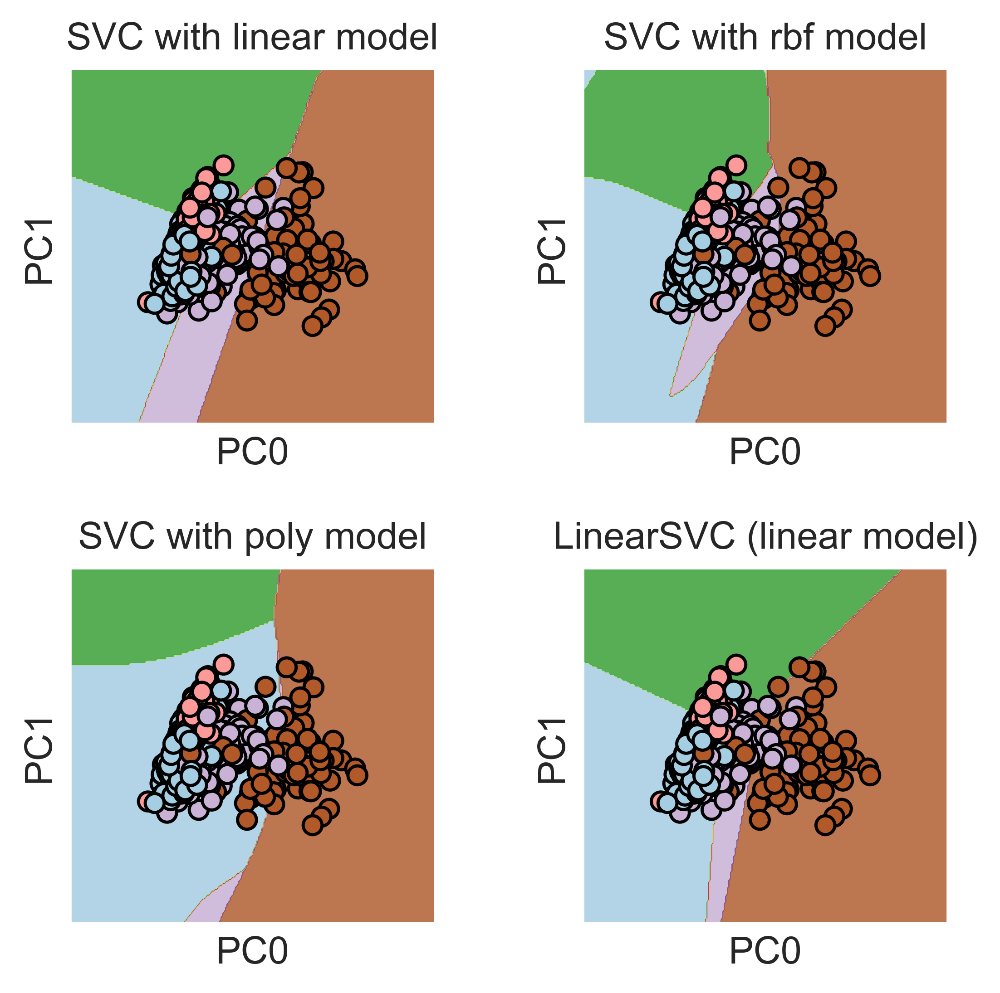

I used PC0 and PC1 to fit the SVM model and used four different kernal functions. Figure 014 is the dicision boundary of SVM, each grid plots different kernal of SVM.


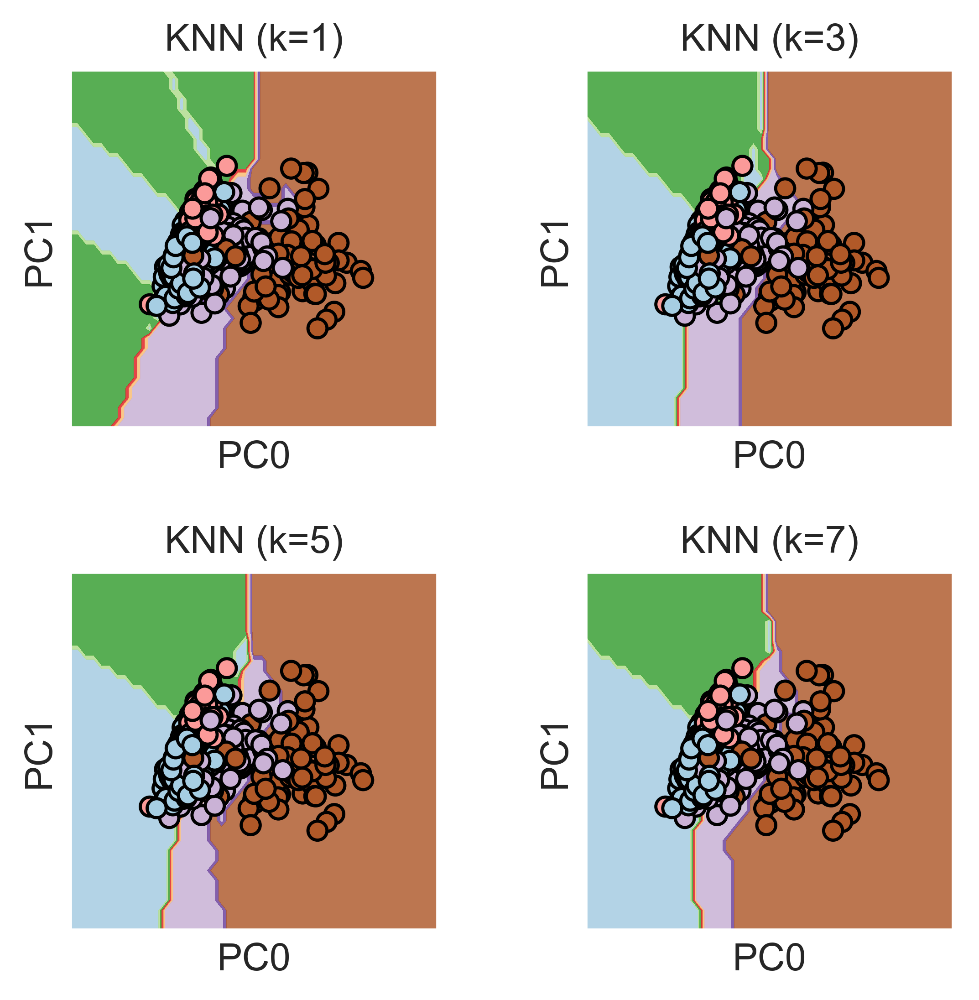

Figure 015 shown the dicision boundary of KNN model, each grid plots different number of neighbour that used to build the classcifier (k=1, k=3, k=5, k=7).

## Appendix

Figure 000

```python
count = Counter(data['class'])
c = [i[1] for i in count.items()]
fig, ax = plt.subplots(dpi=100)
ax = sns.countplot(x="class", data=data)
ax.set_xticklabels(['d(Mixed deciduous\' forest)','h(Hinoki forest)','s(Sugi forest)','o(Other non-forest land)']
                   ,rotation=15)
for p, label in zip(ax.patches, c):
    ax.annotate(label, (p.get_x()+0.3, p.get_height()+2))
ax.set_title('Distributuion of classes')
```

Figure 003-005

```python
may_2011_melt = pd.melt(may_2011, var_name='band', value_name='value',id_vars=['class'])
class_dic = {'d ': 'Mixed deciduous forest', 'h ': 'Hinoki forest', 's ': 'Sugi forest','o ': 'Other non-forest land'}
band_dic = {'b7' : 'green', 'b8': 'red', 'b9': 'near infrared'}
may_2011_melt.replace(class_dic, inplace=True)
may_2011_melt.replace(band_dic, inplace=True)
fig, ax = plt.subplots(dpi=100)
plt.xticks(rotation=15)
g = sns.stripplot(data = may_2011_melt, x='class', y = 'value', hue = 'band', 
              jitter = 0.05, dodge = True, alpha = 0.8, 
              palette = ['g','r','k'])
ax.legend(bbox_to_anchor=(1, 1))
ax.set_title('band value of different forest class (May 08, 2011)')
```

Figure 006 and 007

```python
all_ori_melt = pd.melt(all_ori, var_name='band', value_name='value',id_vars=['class'])
class_dic = {'d ': 'Mixed deciduous forest', 'h ': 'Hinoki forest', 's ': 'Sugi forest','o ': 'Other non-forest land'}
all_ori_melt.replace(class_dic, inplace=True)
fig, ax = plt.subplots(dpi=500)
plt.xticks(rotation=15)
g = sns.stripplot(data = all_ori_melt, x='class', y = 'value', hue = 'band', 
              size=3, edgecolor='k', linewidth=0.4,
              palette = ['r','g','b'],
              jitter = 0.05, dodge = True, alpha = 0.8)
ax = sns.boxplot(x="class", y="value", hue="band", data=all_ori_melt,
                 palette = ['r','g','b'], fliersize=0)
handles, labels = ax.get_legend_handles_labels()
l = plt.legend(handles[0:3], labels[0:3], bbox_to_anchor=(1.05, 1), loc=2, borderaxespad=0.)
ax.set_title('band value of different forest class (All three dates)')
```

Figure 008 to 010

```python
g = sns.pairplot(all_pred_s, hue="class",
                 plot_kws=dict(s=20, edgecolor="k", linewidth=0.2, alpha=0.6))
plt.subplots_adjust(top=0.9)
g.fig.suptitle('Pairplot of pred_s')
```

Figure 011

```python
pca = PCA().fit(data_scaled) 
plt.figure(figsize=(5,5), dpi=150)
plt.plot(np.cumsum(pca.explained_variance_ratio_))
plt.xlabel('Number of Components')
plt.ylabel('percentage') #for each component
plt.title('Explained Variance')
plt.show()
```

Figure 012

```python
fig, ax = plt.subplots(figsize=(5,5),dpi=300)
sns.scatterplot(pca_data_df[0], pca_data_df[1], hue=data_class, alpha=0.8, ax=ax)
handles, labels = ax.get_legend_handles_labels()
ax.set(xlabel='PC0', ylabel='PC1')
l = plt.legend(handles[:], labels[:], bbox_to_anchor=(1.05, 1), loc=2, borderaxespad=0.)
```

Figure 013

```python
fig, ax = plt.subplots(figsize=(5,5),dpi=500)
ax = sns.kdeplot(pca_class_o_pc0, pca_class_o_pc1, cmap="Oranges",
          shade=True, shade_lowest=False)
ax = sns.kdeplot(pca_class_d_pc0, pca_class_d_pc1, cmap="Blues",
          shade=True, shade_lowest=False)
ax = sns.kdeplot(pca_class_s_pc0, pca_class_s_pc1, cmap="YlGn",
          shade=True, shade_lowest=False)
ax = sns.kdeplot(pca_class_h_pc0, pca_class_h_pc1, cmap="Wistia",
          shade=True, shade_lowest=False)
ax.set(xlabel='PC0', ylabel='PC1')

ax.text(-0.9, 0.15, "Sugi forest", size=8, color=sns.color_palette("YlGn")[-2])
ax.text(-0.3, 0.7, "Hinoki forest", size=8, color=sns.color_palette("Wistia")[-2])
ax.text(0, 0.4, "Mixed deciduous forest", size=8, color=sns.color_palette("Blues")[-2])
ax.text(1.5, 0.3, "Other non-forest land", size=8, color=sns.color_palette("Oranges")[-2])
```

Figure 014

```python
X = pca_data_df.iloc[:,:2]
y = data_class

h = 0.02
c = 1.0

svc_lin = svm.SVC(kernel='linear', C=c).fit(X, y)
svc_rbf = svm.SVC(kernel='rbf', C=c, gamma=0.7).fit(X, y)
svc_poly = svm.SVC(kernel='poly', C=c, degree=3).fit(X, y)
svc = svm.LinearSVC(C=c).fit(X, y)

x_min, x_max = X[0].min()-1, X[0].max()+1
y_min, y_max = X[1].min()-1, X[1].max()+1
xx, yy = np.meshgrid(np.arange(x_min, x_max, h),
                     np.arange(y_min, y_max, h))

titles = ['SVC with linear model',
          'SVC with rbf model',
          'SVC with poly model',
          'LinearSVC (linear model)']


plt.figure(figsize=(5,5),dpi=500)
for i, clf in enumerate((svc_lin, svc_rbf, svc_poly, svc)):
    plt.subplot(2, 2, i+1)
    plt.subplots_adjust(wspace=0.4, hspace=0.4)

    Z = clf.predict(np.c_[xx.ravel(), yy.ravel()])
    Z = Z.reshape(xx.shape)

    plt.contourf(xx, yy, Z, cmap=plt.cm.Paired, alpha=0.8)

    plt.scatter(X[0], X[1], c=y*100, cmap=plt.cm.Paired, edgecolors='black')
    plt.xlabel('PC0')
    plt.ylabel('PC1')
    plt.xlim(xx.min(), xx.max())
    plt.ylim(yy.min(), yy.max())

    plt.xticks(())
    plt.yticks(())
    plt.title(titles[i])
```

Figure 015

```python
knn1 = KNeighborsClassifier(n_neighbors=1)
knn3 = KNeighborsClassifier(n_neighbors=3)
knn5 = KNeighborsClassifier(n_neighbors=5)
knn7 = KNeighborsClassifier(n_neighbors=7)

knn1.fit(X, y)
knn3.fit(X, y)
knn5.fit(X, y)
knn7.fit(X, y)

titles = ['KNN (k=1)', 'KNN (k=3)', 'KNN (k=5)', 'KNN (k=7)']

# Plotting decision regions
x_min, x_max = X[0].min() - 1, X[0].max() + 1
y_min, y_max = X[1].min() - 1, X[1].max() + 1
xx, yy = np.meshgrid(np.arange(x_min, x_max, 0.1),
                     np.arange(y_min, y_max, 0.1))


plt.figure(figsize=(5,5),dpi=500)
for i, clf in enumerate((knn1, knn3, knn5, knn7)):
    plt.subplot(2, 2, i+1)
    plt.subplots_adjust(wspace=0.4, hspace=0.4)

    Z = clf.predict(np.c_[xx.ravel(), yy.ravel()])
    Z = Z.reshape(xx.shape)

    plt.contourf(xx, yy, Z, cmap=plt.cm.Paired, alpha=0.8)

    plt.scatter(X[0], X[1], c=y*100, cmap=plt.cm.Paired, edgecolors='black')
    plt.xlabel('PC0')
    plt.ylabel('PC1')
    plt.xlim(xx.min(), xx.max())
    plt.ylim(yy.min(), yy.max())

    plt.xticks(())
    plt.yticks(())
    plt.title(titles[i])
```

## Reference

1. Johnson, B., Tateishi, R., Xie, Z., 2012. Using geographically-weighted variables for image classification. Remote Sensing Letters, 3 (6), 491-499.
2. O' Sullivan, D., Unwin, D., 2003, Geographic Information Analysis, pp. 28–30, 197–202, 227–233 (Hoboken, NJ: Wiley)